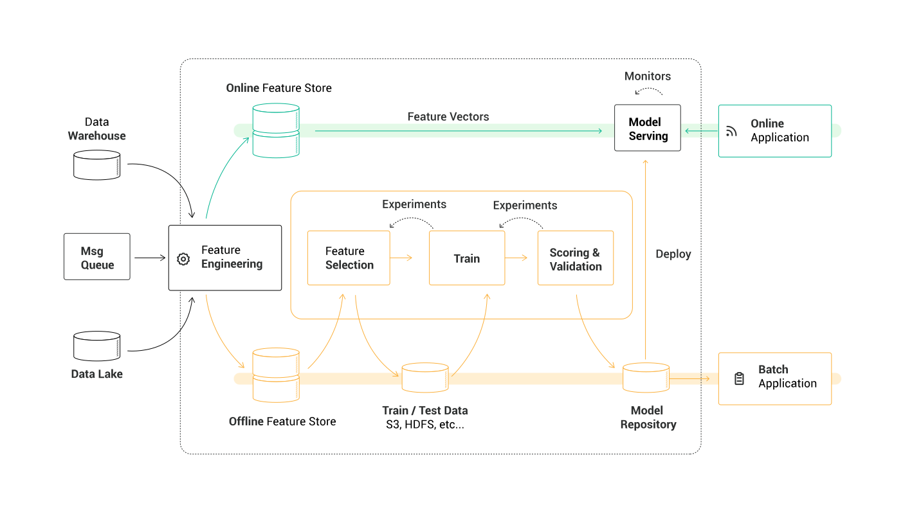

<a href=""></a>

<p align="center">
    <a href="https://hopsworks.ai" alt="hopsworks.ai">
        </a>
    <a href="https://docs.hopsworks.ai" alt="docs.hopsworks.ai">
        </a>
    <a href="https://community.hopsworks.ai" alt="community.hopsworks.ai">
        </a>
    <a href="https://twitter.com/hopsworks" alt="Hopsworks Twitter">
        </a>
    <a href="https://bit.ly/publichopsworks" alt="Hopsworks Slack">
        </a>
</p>

<p align="center">
  Give us a star if you appreciate what we do 
</p>

[ What is Hopsworks? ](#what)  
[ Quick Start ](#quick)  
[ Development and Operational ML on Hopsworks ](#mlops)  
[ Docs ](#docs)  
[ Who’s behind Hopsworks? ](#who)  
[ Open-Source](#open)  
[ Join the community ](#join)  
[ Contribute ](#contribute)  


<a name="what"></a>
## What is Hopsworks?

Hopsworks and its Feature Store are an open source data-intensive AI platform used for the development and operation of machine learning models at scale.



<a name="quick"></a>
### Installer - On-premise

Follow the [installation instructions](https://hopsworks.readthedocs.io/en/stable/getting_started/installation_guide/platforms/hopsworks-installer.html).


The installation takes roughly 1-2 hrs to complete, depending on your bandwidth. 


### Installer - Azure CLI or GCP CLI

Follow the [installation instructions](https://hopsworks.readthedocs.io/en/stable/getting_started/installation_guide/platforms/hopsworks-cloud-installer.html).

If you have the Azure or GCP CLI utilities installed (on a Linux machine), then the Hopsworks-cloud-installer.sh will both install Hopsworks and provision the VMs in one command. 

### Hopsworks IDE Plugin

To work with the Hopsworks IDE plugin for IntelliJ/PyCharm, you can install it directly from the plugins menu of the IDE or [clone it](https://github.com/logicalclocks/hopsworks-ide-plugins) and follow the README.

### Build with Maven
```sh
mvn install
```
Maven uses yeoman-maven-plugin to build both the front-end and the backend.
Maven first executes the Gruntfile in the yo directory, then builds the back-end in Java.
The yeoman-maven-plugin copies the dist folder produced by grunt from the yo directory to the target folder of the backend.

You can also build Hopsworks without the frontend (for Java EE development and testing):
```sh
mvn install -P-web
```

<a name="mlops"></a>
## Development and Operational ML on Hopsworks
You can develop and run Python, Spark, and Flink applications on Hopsworks - in Jupyter notebooks, as jobs, or even notebooks as jobs. You can build production pipelines with the bundled Airflow, and even run ML training pipelines with GPUs in notebooks on Airflow. You can train models on as many GPUs as are installed in a Hopsworks cluster and easily share them among users.

<a name="docs"></a>
## Docs
[Hopsworks documentation](https://hopsworks.readthedocs.io/en/latest/overview/overview.html#) includes a user-guide, Feature Store documentation, and an Administrator Guide. There is also dedicated [documentation for the Hopsworks Feature Store](https://docs.hopsworks.ai/feature-store-api/latest/).

Hopsworks REST API is documented with Swagger and hosted by SwaggerHub.
- **hopsworks-api** - [https://app.swaggerhub.com/apis-docs/logicalclocks/hopsworks-api](https://app.swaggerhub.com/apis-docs/logicalclocks/hopsworks-api)
- **hopsworks-ca** - [https://app.swaggerhub.com/apis-docs/logicalclocks/hopsworks-ca](https://app.swaggerhub.com/apis-docs/logicalclocks/hopsworks-ca)

To build and deploy swagger on your own Hopsworks instance you can follow the instructions found in 
[this](https://hopsworks.readthedocs.io/en/stable/user_guide/hopsworks/microservices.html?highlight=swagger#swagger-ui) guide.


<a name="who"></a>
## Who’s behind Hopsworks?
Hopsworks started as an open-source collaborative project at [KTH University](https://www.kth.se/en), [RISE](https://www.ri.se/en), and has more recently been taken on by [Logical Clocks](https://www.logicalclocks.com/). Several funding bodies have helped contribute to its development including: [European Commission (FP7, H2020)](https://ec.europa.eu/), [EIT](https://eit.europa.eu/), [SSF](https://strategiska.se/), [Vinnova](https://www.vinnova.se/) and [Celtic-Next](https://www.celticnext.eu/).


<a name="open"></a>
## Open-Source
Hopsworks is available under the AGPL-V3 license. In plain English this means that you are free to use Hopsworks and even build paid services on it, but if you modify the source code, you should also release your changes and any systems built around it as AGPL-V3.


<a name="join"></a>
## Join the community
-  Ask questions and give us feedback in the [Hopsworks Community](https://community.hopsworks.ai/)
- Join our Public [Slack Channel](https://bit.ly/publichopsworks)
- Follow us on [Twitter](https://twitter.com/hopsworks)
- Check out all our latest [product releases](https://github.com/logicalclocks/hopsworks/releases)


<a name="contribute"></a>
## Contribute
We are building the most complete and modular ML platform available in the market and we count on your support to continuously improve Hopsworks. Feel free to [give us suggestions](https://github.com/logicalclocks/feature-store-api), [report bugs](https://github.com/logicalclocks/feature-store-api/issues) and [add features to our library](https://github.com/logicalclocks/feature-store-api) anytime.  

We’re the best in what we do and want our community to succeed as well.  
Our many thanks to the top contributors of Hopsworks!


Enjoy!
