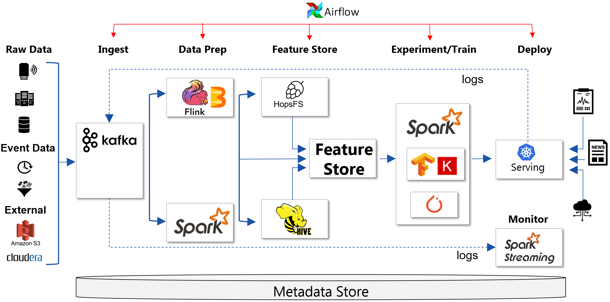

# Hopsworks

[](https://community.hopsworks.ai)

## Overview

<!-- <a href=""></a> -->

<a href=""></a>
**Hopsworks** is a platform for both the design and operation of data analytics and machine learning applications. You can design ML applications in Jupyter notebooks in Python and operate them in workflows orchestrated by Airflow, while running on HopsFS, the world's most scalable HDFS-compatible distributed hierarchical filesystem (<a href="https://www.usenix.org/conference/fast17/technical-sessions/presentation/niazi">peer-reviewed, 1.2m ops/sec on Spotify's Hadoop workload</a>). HopsFS also <a href="http://www.diva-portal.org/smash/get/diva2:1260838/FULLTEXT01.pdf">solves the small-files problem of HDFS</a>, by storing small files on NVMe disks in the horizontally scalable metadata layer. Hopsworks is also a platform for data engineering, with support for Spark, Flink, and Kafka. As an on-premises platform, Hopsworks has unique support for project-based multi-tenancy, horizontally scalable ML pipelines, and managed GPUs-as-a-resource.


<a href=""></a>

## Multi-tenancy - Projects, Users, Datasets
Hopsworks provides Projects as a privacy-by-design sandbox for data, including sensitive data, and for managing collaborating teams - like GitHub.
Datasets can be shared between projects - like Dropbox. Each project has its own Anaconda environment, enabling python dependencies to be managed by the data scientists themselves.

## HopsML

<a href=""></a>

HopsML is our framework for writing end-to-end machine learning workflows in Python. We support Airflow to orchestrate workflows with: ETL in PySpark or TensorFlow, a Feature Store, AutoML hyperparameter optimization techniques over many hosts and GPUs in Keras/TensorFlow/PyTorch, in addition to distributed training such as Collective AllReduce.

Jupyter notebooks can be used to write all parts of the pipeline, and TensorBoard to visualize experiment results during and after training. Models can be deployed in Kubernetes (built-in or external) and monitored in production using Kafka/Spark-Streaming. For more information see the [docs](https://hopsworks.readthedocs.io/en/latest/hopsml/hopsML.html).

## Feature Store

<a href=""></a>

The feature store is as a central place to store curated features for machine learning pipelines in Hopsworks. A feature is a measurable property of some data-sample. It could be for example an image-pixel, a word from a piece of text, the age of a person, a coordinate emitted from a sensor, or an aggregate value like the average number of purchases within the last hour. Features can come directly from tables or files or can be derived values, computed from one or more data sources. For more information see the [docs](https://hopsworks.readthedocs.io/en/latest/featurestore/featurestore.html).

## TLS security

<p align="center">
  <a href=""></a>
</p>

Uniquely in Hadoop, Hops supports X.509 certificates for authentication and authorization: users, services, jobs and TLS for in-flight encryption. At-rest encryption is also supported using ZFS-on-Linux.

## HopsFS

<p align="center">
  <a href=""></a>
</p>

HopsFS is a drop-in replacement for HDFS that adds distributed metadata and "small-files in metadata (NVMe disks)" support to HDFS.

## Information

<ul>
<li><a href="https://twitter.com/hopsworks">Follow our Twitter account.</a></li>
<li><a href="https://community.hopsworks.ai">Join our support forum.</a></li>
<li><a href="https://bbc1.sics.se/jenkins/job/Hopsworks-build/">Checkout the current build status.</a></li>
</ul>

## Documentation

Hopsworks documentation, includung user-guide, development guide, feature store, hops, HopsML, is available at 
[https://hopsworks.readthedocs.io](https://hopsworks.readthedocs.io).

Hopsworks REST API is documented with Swagger and hosted by SwaggerHub.
- **hopsworks-api** - [https://app.swaggerhub.com/apis-docs/logicalclocks/hopsworks-api](https://app.swaggerhub.com/apis-docs/logicalclocks/hopsworks-api)
- **hopsworks-ca** - [https://app.swaggerhub.com/apis-docs/logicalclocks/hopsworks-ca](https://app.swaggerhub.com/apis-docs/logicalclocks/hopsworks-ca)

To build and deploy swagger on your own Hopsworks instance you can follow the instructions found in 
[this](https://hopsworks.readthedocs.io/en/latest/developer_guide/guide/microservices.html#swagger-ui) guide.
## Installing Hopsworks

Installation of Hopsworks and all its services is automated with the Karamel software. Instructions on
 how to install the entire platform are available [here](http://hopsworks.readthedocs.io).

For a local single-node installation, to access Hopsworks just point your browser at:
```
  http://localhost:8080/hopsworks
  usename: admin@hopsworks.ai
  password: admin
```
Admin email may differ on your installation. Please refer to your Karamel cluster definition to access/set the 
email.

## Build instructions
Hopsworks consists of the backend module which is packaged in two files, `hopsworks.ear`  and `hopsworks-ca.war`,
and the front-end module which is packaged in a single `.war` file.


### Build Requirements (for Ubuntu)
NodeJS server and bower, both required for building the front-end.

```sh
sudo apt install nodejs-legacy
sudo apt-get install npm
sudo npm cache clean
# You must have a version of bower > 1.54
sudo npm install bower -g
sudo npm install grunt -g
```

### Build with Maven
```sh
mvn install
```
Maven uses yeoman-maven-plugin to build both the front-end and the backend.
Maven first executes the Gruntfile in the yo directory, then builds the back-end in Java.
The yeoman-maven-plugin copies the dist folder produced by grunt from the yo directory to the target folder of the backend.

You can also build Hopsworks without the frontend (for Java EE development and testing):
```sh
mvn install -P-web
```

## Front-end Development

The javascript produced by building maven is obsfuscated. For debugging javascript, we recommend that you use the following script
to deploy changes to HTML or javascript to your vagrant machine:

```sh
cd scripts
./js.sh
```

You should also add the chef recipe to the end of your Vagrantfile (or Karamel cluster definition):
```
 hopsworks::dev
```


#### For development

You can build Hopsworks without running grunt/bower using:

```
mvn install -P-dist
```

Then run your script to upload your javascript to snurran.sics.se:

```
cd scripts
./deploy.sh [yourName]
```


## Testing Guide
The following steps must be taken to run Hopsworks integration tests:


```diff
-Warning: This test will clean hdfs and drop Hopsworks database. So it should only be used on a test machine.
```

First create a .env file by copying the .env.example file. Then edit the .env file by providing your specific configuration.
```sh
   cd hopsworks/hopsworks-IT/src/test/ruby/
   cp .env.example .env
```


Then export environments to match the server you are deploying to:
```
   GLASSFISH_HOST_NAME=localhost
   GLASSFISH_HTTP_PORT=8181
   GLASSFISH_ADMIN_PORT=4848
```
Change the server login credentials in hopsworks-IT/pom.xml
```xml
  <properties>
    ...
    <glassfish.admin>{username}</glassfish.admin>
    <glassfish.passwd>{password}</glassfish.passwd>
    ...
  </properties>
```

Export environments for Selenium integration test:
```
   HOPSWORKS_URL=http://localhost:8181/hopsworks
   HEADLESS=[true|false]
   BROWSER=[chrome|firefox]
```

To compile, deploy and run the integration test:
```sh
   cd hopsworks/
   mvn clean install -Pjruby-tests
```

If you have already deployed hopsworks-ear and just want to run the integration test:

```sh
   cd hopsworks/hopsworks-IT/src/test/ruby/
   bundle install
   rspec --format html --out ../target/test-report.html
```
To run a single test
```sh
   cd hopsworks/hopsworks-IT/src/test/ruby/
   rspec ./spec/session_spec.rb:60
```
To skip tests that need to run inside a vm
```sh
   cd hopsworks/hopsworks-IT/src/test/ruby/
   rspec --format html --out ../target/test-report.html --tag ~vm:true
```
When the test is done if `LAUNCH_BROWSER` is set to true in `.env`, it will open the test report in a browser.
